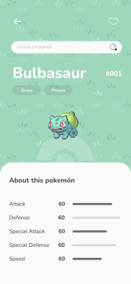
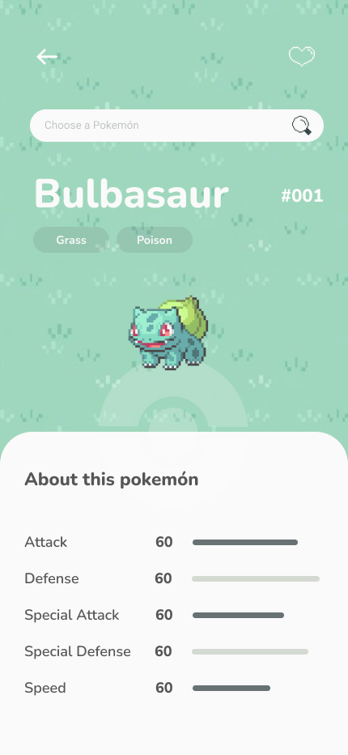

# Pokédex Project

<h4>This is a project to practice and study DOM manipulation, asynchronous functions, CSS, JavaScript, and important programming fundaments. Currently, I'm working only with the mobile version. The goal of this Pokédex is to search for pokémons, see their main base stats and add them into local storage (favorites). To do so, the app consumes data from PokeAPI.</h4>

<h4> Take a look on how the project is so far 👇🏻</h4>

<a>https://giovanacassias.github.io/pokedex-project/</a>

<h4>This is the prototype that I've created on Figma 👇🏻</h4>

<a>https://www.figma.com/proto/9ANkqdNFhGKza6ynOEs3RK/pokemon-project?node-id=52-248&t=GQqssbVi2jVIPYkb-1&scaling=scale-down&content-scaling=fixed&page-id=1%3A2<a>
